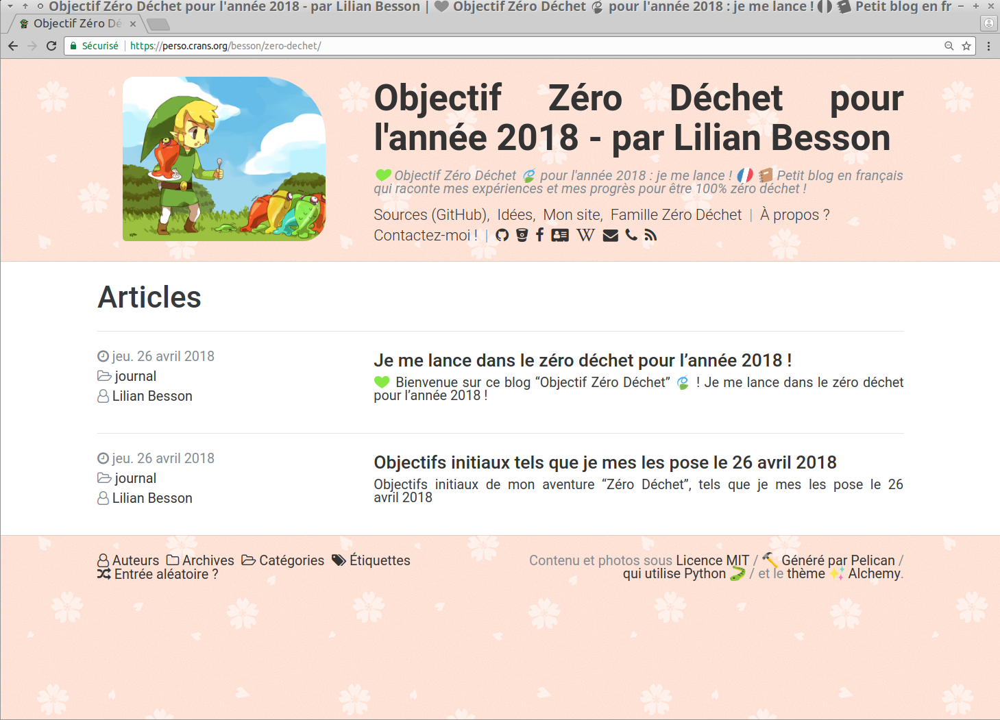

# 💚 Objectif Zéro Déchet 🍃 pour l'année 2018 : je me lance !
## *🇫🇷 📒 Petit blog en français qui raconte mes expériences et mes progrès pour être 100% zéro déchet !*

Ce projet contient les sources pour [ce dossier](https://perso.crans.org/besson/zero-dechet/) sur [mon site web](https://perso.crans.org/besson/), qui contient un petit blog, écrit depuis avril 2018.
Ce blog raconte(ra) mon aventure dans le zéro déchet, dans le but de supprimer (presque) complètement ma consommation de déchets non recyclable, d'ici décembre 2018.

- Des idées recettes, cuisine et cosmétique !
- Des liens vers les sites web utiles et les boutiques pratiques à Rennes !
- Des articles racontant certaines galères ou certaines réussites !

----

## Améliorations encore possibles / déjà réussies

 / 

----

## Outils et dépendances

- [Pelican](http://getpelican.com/) pour la génération du site :hammer:,
- [Thème](themes/alchemy) : [`pelican-alchemy`](https://nairobilug.github.io/pelican-alchemy/) :sparkles: (version un peu modifiée, traduite en français :fr:), par [@nairobilug](https://GitHub.com/nairobilug/),
- [Greffons](plugins/) : [`neighbors`](https://github.com/getpelican/pelican-plugins/tree/master/neighbors) :left_right_arrow:, [`global_license`](https://github.com/getpelican/pelican-plugins/tree/master/global_license), [`random_article`](https://github.com/getpelican/pelican-plugins/tree/master/random_article), [`simple_footnotes`](https://github.com/getpelican/pelican-plugins/tree/master/simple_footnotes), [`section_number`](https://github.com/getpelican/pelican-plugins/tree/master/section_number),
- Mes propres photos :camera: pour chaque recettes,
- Et... de l'amour !

----

## :scroll: Licence ? 
Ce dépôt git et tous les fichiers contenus sont publiés librement sous les termes de la [Licence MIT](https://lbesson.mit-license.org/) (voir le fichier [LICENSE](LICENSE)).
© [Lilian Besson](https://GitHub.com/Naereen), 2018.

